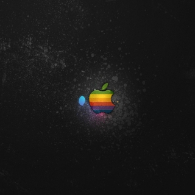

  
<body>

	<h1> BizzyzRepo</h1>

	

		
<b>BizzyzRepo</b> is a Cydia repository.

		<a class="btn btn-sm btn-default" href="cydia://url/https://cydia.saurik.com/api/share#?source=https://BizzyzModz.github.io/BizzyzRepo/">Add to Cydia</a>
	

  <h3 id="wells" class="page-header">⬇️ Top DownLoads ⬇️</h3>

	

	  
✅ BlockHeads Hack ✅

	  

		BlockHeads - Modified 💰Store💰 + a lot more  ▪️ Debug ▪️ No jailbreak Detection😜  
	  

	

	

	  
✅ DeepWorld Hack ✅

	  

		DeepWorld - God Mode ▪️ Unlimited steam + a lot more  ▪️ Debug ▪️ No jailbreak Detection😜  
	  

	

	

	  
✅ Spotify App ✅

	  

		Spotify - Modified Premium Member + a lot more  ▪️ Debug ▪️ No jailbreak Detection😜  
	  

	

  <h3 id="wells" class="page-header"> 👇 Android Hacks 👇</h3>

	

	  
❗️❗️VISIT REPO BELOW❗️❗️

	  
        
😜From Mod Menus to Hacked Balances 👇https://miniprohackerbtw.github.io/MiniProHacker.github.io/☝️
Download Links Available 😜  
	  

	

  

		 ⚫️🔴🔵——- PLEASE CHECK BACK FOR NEW RELEASES ——-🔵🔴⚫️  
	  

	

</body>
</html>
